# LiDAR Relief Plugin User Guide — v2.2

## Introduction
The LiDAR Relief QGIS Plugin provides archaeologically optimized terrain
visualization tools. It allows you to process Digital Elevation Models (DEMs)
into highly readable formats to identify subtle micro-topography such as
ancient ditches, walls, mounds, and paths.

**v2.0 expanded the plugin from a pure visualization tool into a complete
prospection platform**, adding point cloud processing, multi-temporal change
detection, multi-sensor fusion, AI feature detection, and professional
export/publishing capabilities.

**v2.1 makes the toolbox easier to navigate and its results easier to trust.**
A Visualisation Contact Sheet renders several techniques side by side so you
can pick one before committing to a full run; search radii can be given in
metres rather than pixels, so a setting means the same thing on a 0.25 m and a
2 m DEM; AI segmentation models now produce class rasters and polygons; and
every terrain output is written with a provenance sidecar recording exactly
how it was made.

## Quick start

1. Install the plugin from **Plugins → Manage and Install Plugins…** by
   searching for **LiDAR Relief Visualization**.
2. Load a projected DEM. Metric horizontal and vertical units are strongly
   recommended so radii, slopes, and relief values remain interpretable. From
   v2.1 the plugin warns in the Processing log if your DEM uses a geographic
   (latitude/longitude) CRS or has non-square pixels, both of which make
   distance-based results meaningless.
3. Open **Processing Toolbox → LiDAR Relief**.
4. Hover over or use QGIS's contextual-help control for any setting to see a
   plain-language explanation and practical starting guidance.
5. Not sure which visualization suits your landscape? Run **Visualisation
   Contact Sheet** first. It renders several techniques over the same ground
   as one labelled image in a few seconds.
6. For an initial survey, run **Batch Relief Visualisation** with the landscape
   preset closest to your study area.
7. Inspect several complementary outputs. No single visualization or automated
   detection should be treated as an archaeological classification.
8. Record the input dataset, CRS, resolution, parameters, plugin version, and
   outputs. Provenance sidecars now capture most of this automatically;
   Visualization Recipes and PDF reports also assist reproducibility.

### Contextual parameter help

Every LiDAR Relief processing setting includes contextual help covering what it
changes, expected units, and practical considerations such as scale,
performance, or safe starting values. Depending on your QGIS version, this help
may appear beside the setting as a `?`, in a tooltip, or in the processing
dialog's help panel.

An optional short introduction explains where to find this help the first time
the plugin starts. Select **Show this introduction again when QGIS starts** if
you want it repeated. You can reopen it at any time from **Plugins → LiDAR
Relief → Contextual Help…**. The processing dialog's **Help** button still
opens the complete algorithm guide.

### LiDAR Relief menu

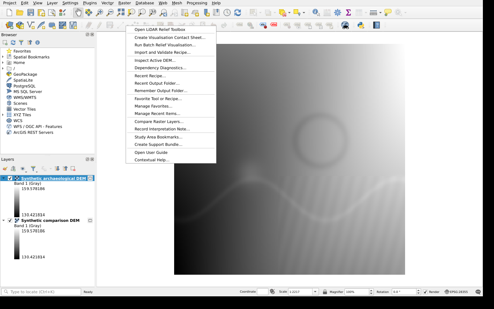

The **Plugins → LiDAR Relief** menu collects the best starting workflows:

- **Open LiDAR Relief Toolbox** opens QGIS's Processing toolbox.
- **Create Visualisation Contact Sheet…** and **Run Batch Relief
  Visualisation…** open native Processing dialogs and prefill the active DEM
  when possible.
- **Inspect Active DEM…** reports CRS, resolution, dimensions, coverage,
  sampled elevation and nodata statistics, approximate memory, and practical
  starting scales. If no local raster is active, it asks you to choose one.
- **Dependency Diagnostics…** reports which optional GPU, point-cloud, AI,
  export, temporal, and fusion capabilities are available. Use **Copy** to
  include the report in a support request.
- **Recent Recipe…** reopens successfully imported or exported recipes.
- **Recent Output Folder…** opens output locations returned by menu-launched
  workflows. **Remember Output Folder…** adds any other working folder.
- **Favorite Tool or Recipe…** opens a saved favorite. **Manage Favorites…**
  selects tools and recent recipes to pin, while **Manage Recent Items…**
  removes history entries without deleting the files themselves.
- **Compare Raster Layers…** opens two loaded rasters in synchronized,
  non-destructive map views.
- **Record Interpretation Note…** records the map-centre location with a title,
  interpretation, confidence, and visualization as WGS84 GeoJSON or CSV.
- **Study Area Bookmarks…** saves and restores named extents together with
  their CRS. **Create Support Bundle…** writes redacted diagnostics and, when
  a DEM is active, its preflight report to a ZIP suitable for a bug report.
- **Open User Guide** opens this complete guide.

Preflight recommendations are conservative visualisation starting points. A
bare-earth DEM cannot determine land cover or prove that a feature is
archaeological; compare complementary outputs and independent evidence.

#### Inspect a DEM before processing

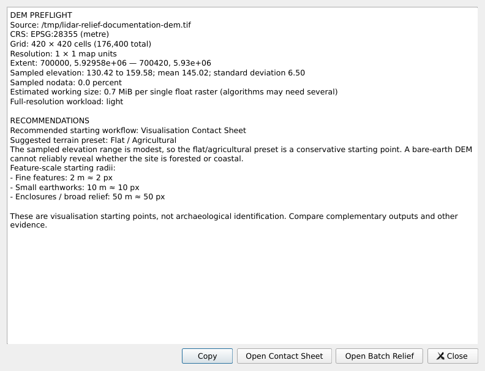

**How to use it**

1. Select a DEM layer in **Layers**.
2. Choose **Plugins → LiDAR Relief → Inspect Active DEM…**.
3. Check that the CRS is projected, units are metres, pixels are square, and
   the resolution suits the feature scale.
4. Use **Open Contact Sheet** for exploration or **Open Batch Relief** to
   transfer the recommended landscape preset into a full workflow.

#### Check optional capabilities

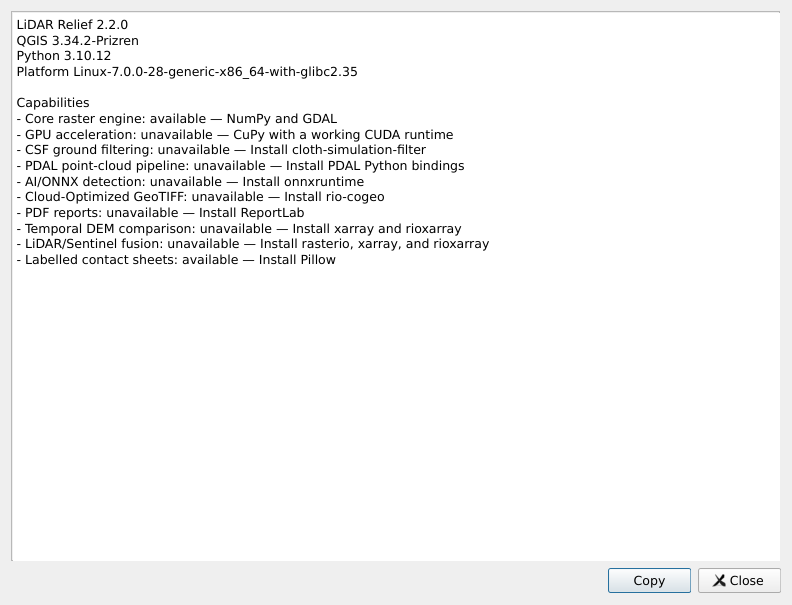

**How to use it**

1. Choose **Dependency Diagnostics…** from the plugin menu.
2. Read each capability row; core terrain tools work without most optional
   packages.
3. Install only the dependency needed by a missing workflow, restart QGIS, and
   reopen the report.
4. Use **Copy** when reporting a problem so support receives the exact
   environment without guesswork.

#### Use contextual help

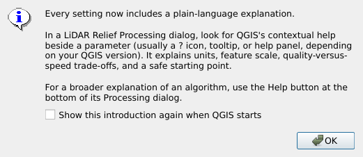

**How to use it**

1. Hover over a Processing setting or use its `?` control for concise advice.
2. Use **Help** in an algorithm dialog for the full guide.
3. Reopen the introduction from **Contextual Help…**.
4. Untick its startup preference if you no longer want the introductory dialog;
   parameter help remains available.

#### Save favorites and manage recent work

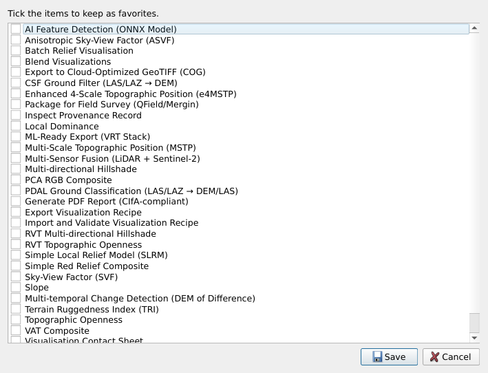

**How to use it**

1. Choose **Manage Favorites…** and tick frequently used tools or recent
   recipes.
2. Open a pinned item from **Favorite Tool or Recipe…**.
3. Use **Recent Recipe…** or **Recent Output Folder…** to resume a session.
4. Use **Manage Recent Items…** to remove history entries. This does not delete
   recipes or output folders.

#### Compare two rasters

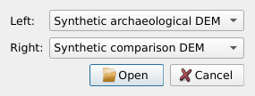

**How to use it**

1. Load both rasters into QGIS.
2. Choose **Compare Raster Layers…**, then assign the left and right layers.
3. Click **Open** and pan/zoom either synchronized view.
4. Match CRS, extent, cell size, and colour stretch before drawing conclusions;
   the comparison viewer does not modify either layer.

#### Record an interpretation note

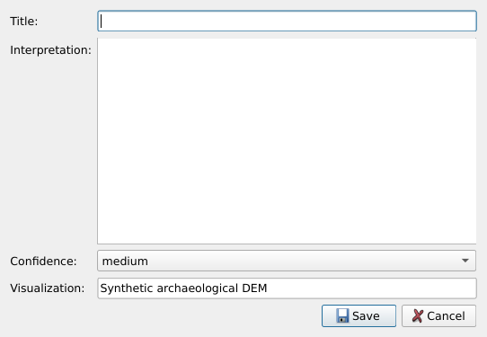

**How to use it**

1. Centre the map on the observation and choose **Record Interpretation
   Note…**.
2. Enter a title, cautious interpretation, confidence, and visualization used.
3. Append to GeoJSON for spatial work or CSV for tabular review.
4. Reopen the saved file in QGIS and verify the WGS84 location; separate
   observation, inference, and follow-up action in your wording.

#### Save and restore study areas

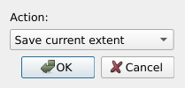

**How to use it**

1. Zoom to the desired extent and open **Study Area Bookmarks…**.
2. Give the extent a meaningful site/area name and save it.
3. Select a bookmark later to restore its CRS-aware extent.
4. Manage bookmarks as navigation aids; use a project or spatial layer for
   authoritative site boundaries.

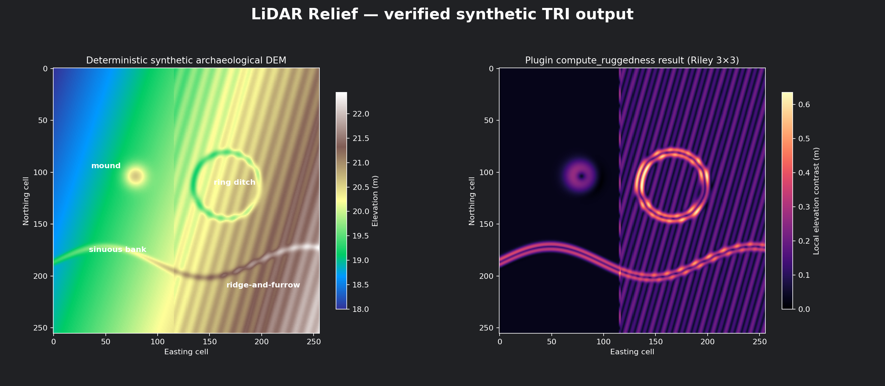

*This is verified output rather than a mockup or QGIS screenshot. The
deterministic DEM is shown on the left; the right panel is calculated directly
by the plugin's current `compute_ruggedness` implementation. The vivid colour
ramps style the unchanged values for readability. The committed generator is
`scripts/generate_tri_documentation_image.py`. Real anomalies still require
contextual interpretation and, where appropriate, field validation.*

---

## Algorithm Reference

Every image in this reference is an **actual QGIS screenshot**, captured from
the released plugin against a deterministic synthetic DEM. None of the dialog
images is a mockup. Capture details, QGIS/plugin versions, and the source image
for every screenshot are recorded in
[`docs/images/screenshot-manifest.json`](docs/images/screenshot-manifest.json).

### Visual feature guide

Open any tool below from **Processing Toolbox → LiDAR Relief**, or type part of
its name into the Toolbox search box. The parameter panel itself contains
hover help; these recipes explain a useful first run.

<!-- feature:lidar_relief:multidirectional_hillshade -->
#### Multi-directional Hillshade

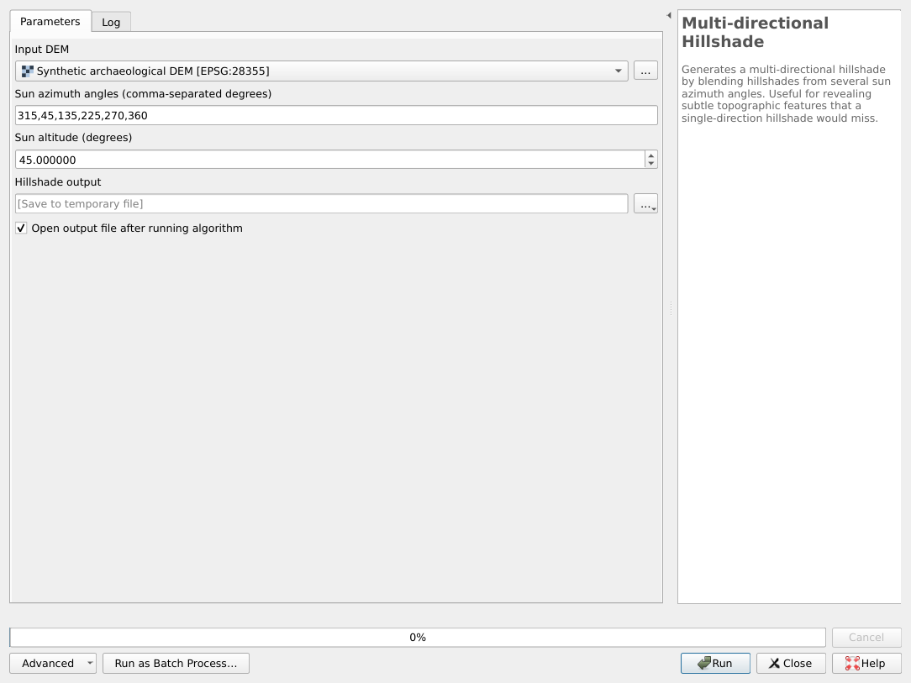

**How to use it**

1. Select a projected bare-earth DEM.
2. Keep the default four azimuths for an orientation-neutral first pass.
3. Set altitude to about 35–45 degrees; lower light exaggerates small scarps
   but also exaggerates noise.
4. Choose an output GeoTIFF and click **Run**. Compare the result with SVF or
   openness so features aligned with one illumination direction are not missed.

<!-- feature:lidar_relief:simple_local_relief_model -->
#### Simple Local Relief Model (SLRM)

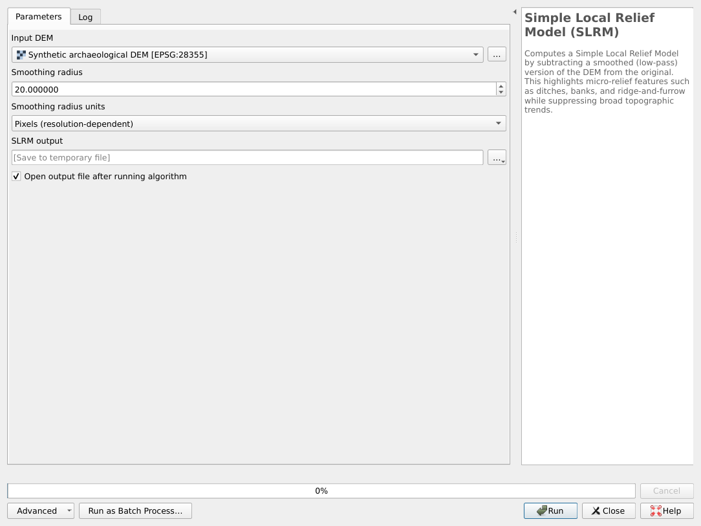

**How to use it**

1. Select the DEM and choose pixels or metres for the trend radius.
2. Start with a radius slightly larger than the feature you want to reveal.
3. Run to subtract broad terrain from local relief; positive values are locally
   raised and negative values locally lowered.
4. Repeat with a second radius when surveying mixed feature sizes, and avoid
   treating edge artefacts as archaeology.

<!-- feature:lidar_relief:sky_view_factor -->
#### Sky-View Factor (SVF)

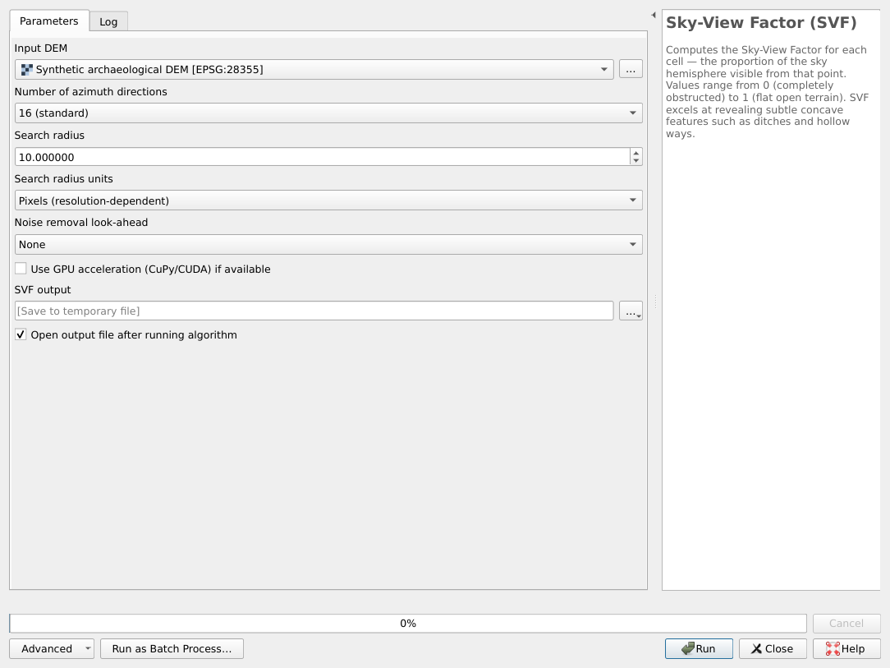

**How to use it**

1. Select the DEM, then choose radius units.
2. Start with 16 directions and a radius near the width of the earthworks.
3. Increase directions for smoother output or reduce them for a faster preview.
4. Run and inspect low values for enclosed/concave ground and high values for
   exposed ground; cross-check against hillshade.

<!-- feature:lidar_relief:asvf -->
#### Anisotropic Sky-View Factor (ASVF)

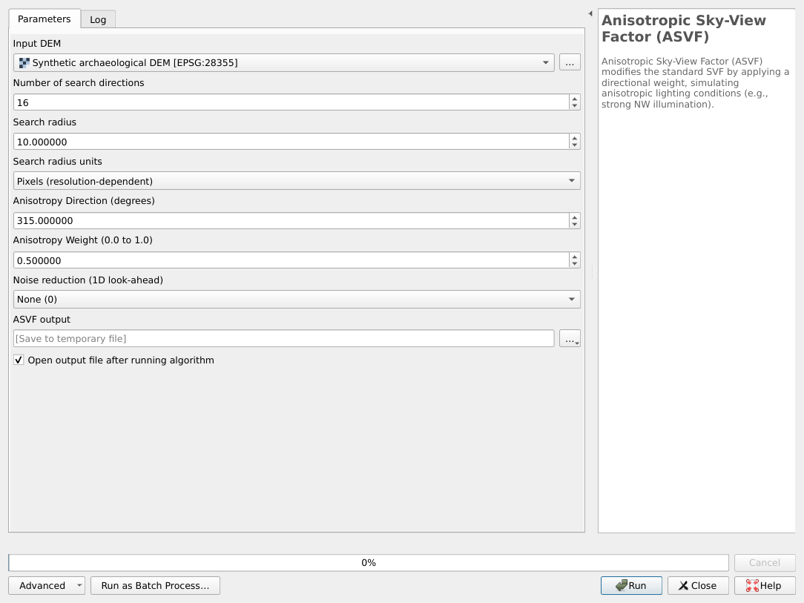

**How to use it**

1. Select the DEM and set a search radius appropriate to the target scale.
2. Set the principal direction across, rather than along, a suspected linear
   feature.
3. Begin with moderate anisotropy, run, then rotate the direction by 90 degrees
   for comparison.
4. Treat direction-dependent responses as leads and verify them in a
   direction-neutral visualization.

<!-- feature:lidar_relief:topographic_openness -->
#### Topographic Openness

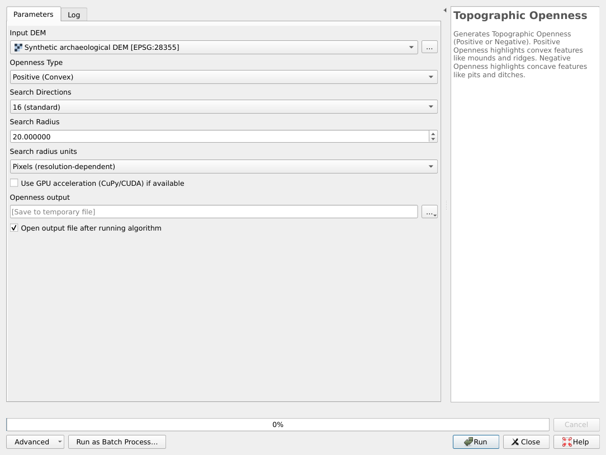

**How to use it**

1. Select the DEM, radius units, search radius, and number of directions.
2. Choose positive openness for crests/walls or negative openness for
   ditches/hollows.
3. Use 16 directions for a balanced first pass and click **Run**.
4. Compare positive and negative products at the same radius; their numeric
   values are angular measures, not elevation.

<!-- feature:lidar_relief:rvt_multidirectional_hillshade -->
#### RVT Multi-directional Hillshade

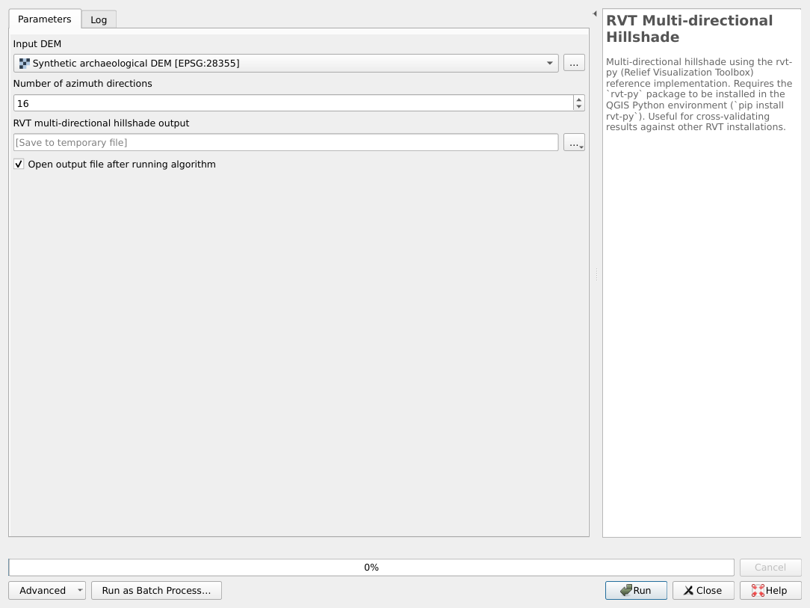

**How to use it**

1. Install `rvt-py`, restart QGIS, and confirm it in **Dependency
   Diagnostics**.
2. Select the DEM and set illumination parameters.
3. Run the reference RVT implementation.
4. Use this output when matching an RVT-based published method or checking the
   plugin's native hillshade workflow.

<!-- feature:lidar_relief:rvt_openness -->
#### RVT Topographic Openness

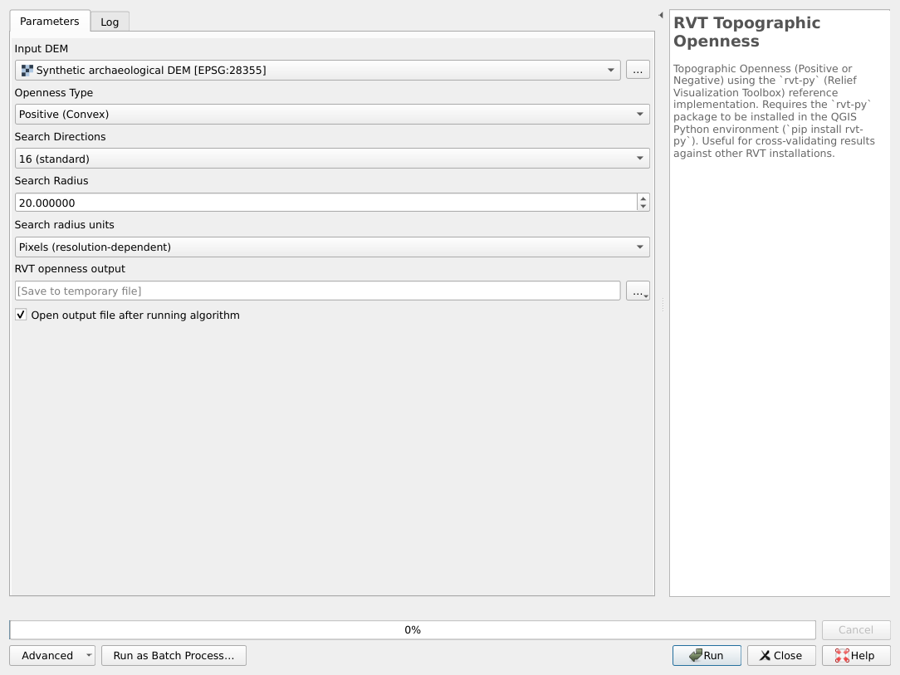

**How to use it**

1. Confirm `rvt-py` is available, then select the DEM.
2. Choose positive or negative openness, radius, and directions.
3. Run and style the result with a perceptually ordered colour ramp.
4. Record the radius and DEM resolution when comparing with published RVT
   results.

<!-- feature:lidar_relief:local_dominance -->
#### Local Dominance

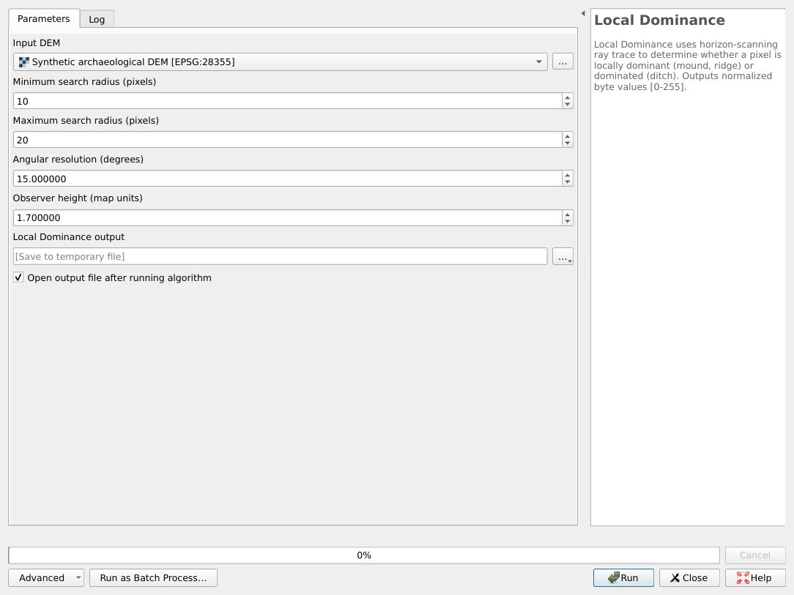

**How to use it**

1. Select the DEM and set minimum/maximum radii around the expected feature
   scale.
2. Keep the observer height near the default for a first survey.
3. Run and inspect high values for locally dominant forms such as mounds and
   banks.
4. Re-run with a wider radius range to test whether an anomaly persists across
   scales.

<!-- feature:lidar_relief:mstp -->
#### Multi-Scale Topographic Position (MSTP)

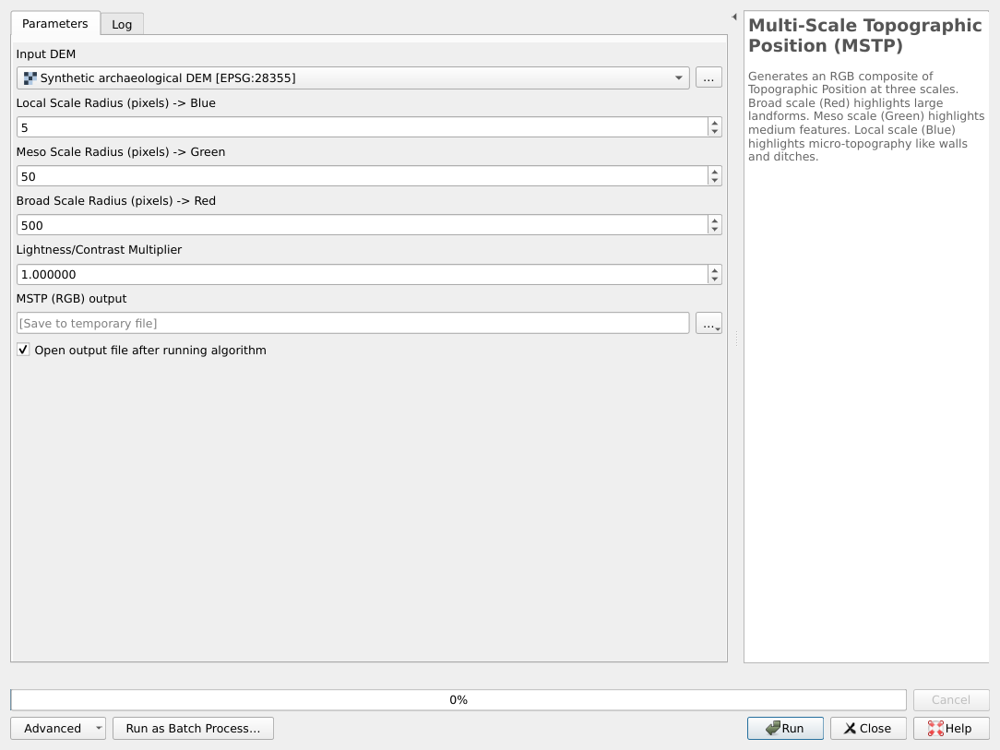

**How to use it**

1. Select the DEM and set broad, meso, and local radii in ascending order.
2. Match the local scale to small earthworks and the broad scale to the
   surrounding landform.
3. Run to create an RGB composite where colour encodes responses at the three
   scales.
4. Interpret colour as a scale combination, not as a material or date.

<!-- feature:lidar_relief:e4mstp -->
#### Enhanced 4-MSTP (e4MSTP)

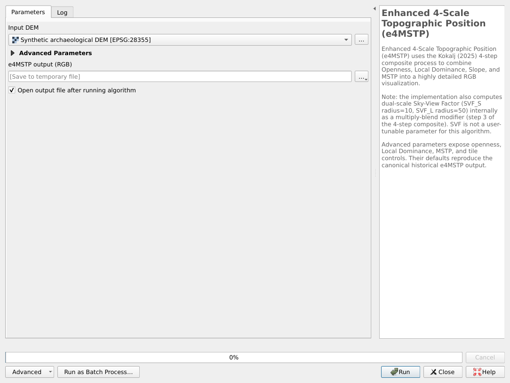

**How to use it**

1. Select a DEM and begin with the defaults or a landscape preset.
2. Adjust local-dominance, openness, and MSTP scales only after inspecting a
   default result.
3. Set tile size lower if memory is constrained, then run.
4. Use this dense composite for flat/alluvial surveys and consult simpler
   layers to understand which component produced an anomaly.

<!-- feature:lidar_relief:vat_composite -->
#### VAT Composite

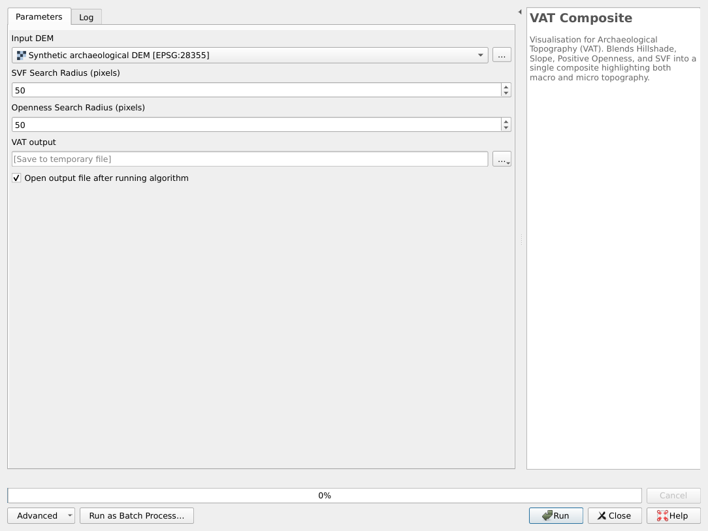

**How to use it**

1. Select the DEM and review the hillshade, slope, and openness contribution
   settings.
2. Run with defaults for a balanced visualization.
3. Adjust weights only when one component overwhelms the others.
4. Export the composite for mapping, but retain the component rasters for
   analytical interpretation.

<!-- feature:lidar_relief:simple_red_relief -->
#### Simple Red Relief

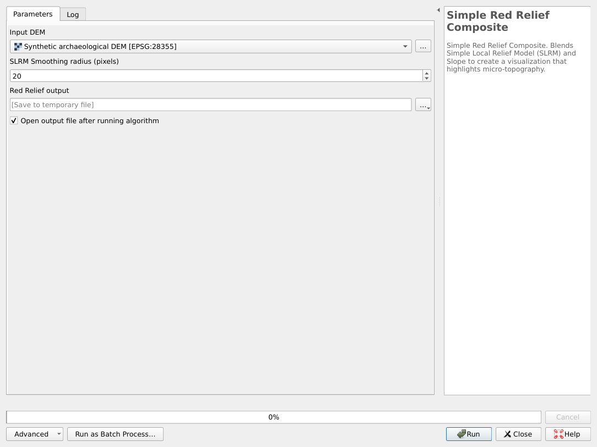

**How to use it**

1. Select the DEM and set slope/local-relief parameters to the expected feature
   scale.
2. Run to combine steepness and local relief in a patent-free red-relief-style
   product.
3. Use it for rapid visual scanning, particularly where conventional shading
   hides orientation.
4. Verify candidates in the underlying numerical layers before measurement.

<!-- feature:lidar_relief:pca_composite -->
#### PCA Composite

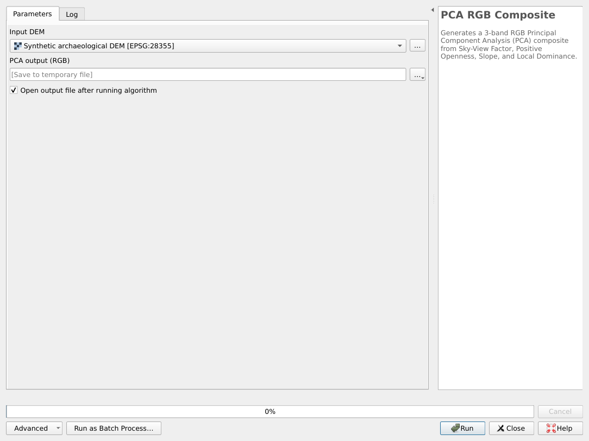

**How to use it**

1. Select the DEM and choose the number of illumination directions.
2. Use at least 16 directions for a stable first result.
3. Run to reduce the directional hillshade stack into an RGB PCA composite.
4. PCA colours have no fixed archaeological meaning; look for coherent shape
   and confirm it in individual hillshades.

<!-- feature:lidar_relief:slope -->
#### Slope

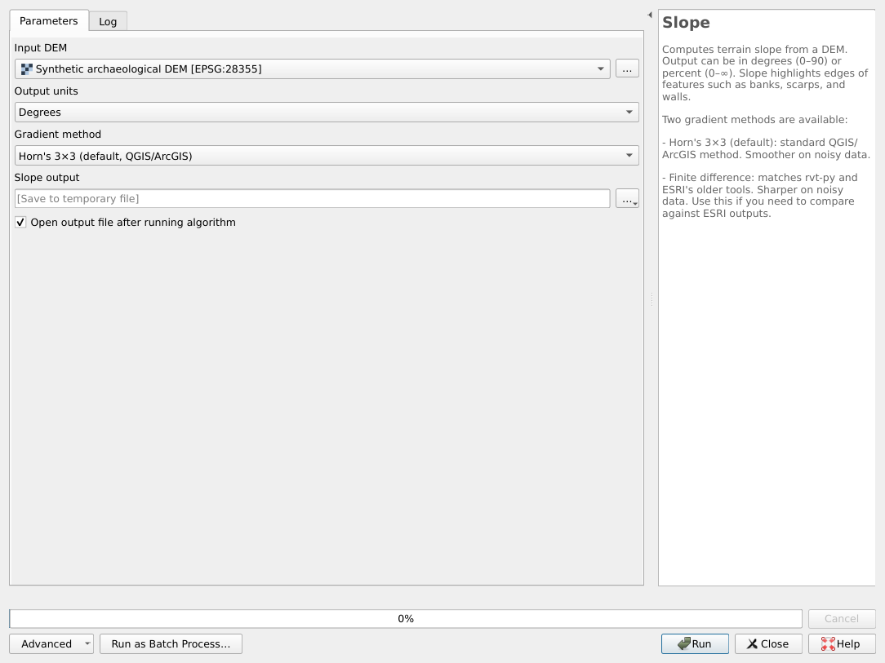

**How to use it**

1. Select a projected DEM with known horizontal and vertical units.
2. Choose degrees for interpretation or percent for engineering-style output.
3. Set a vertical exaggeration only if the horizontal and vertical units
   differ, then run.
4. Use slope to distinguish scarps and banks, while remembering that noise and
   vegetation remnants also create steep cells.

<!-- feature:lidar_relief:terrain_ruggedness_index -->
#### Terrain Ruggedness Index (TRI)

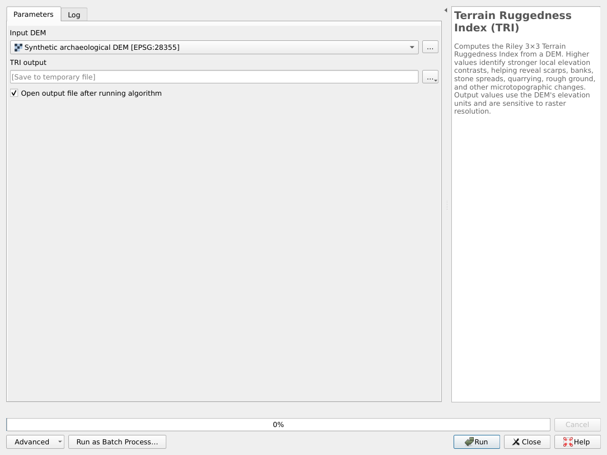

**How to use it**

1. Select the DEM and an output GeoTIFF.
2. Run to measure each cell's contrast with its eight neighbours.
3. Style from low to high values; high values highlight sharp local variation.
4. Compare only DEMs with similar cell size and units, because TRI is
   resolution-dependent.

<!-- feature:lidar_relief:blend_rasters -->
#### Blend Visualizations

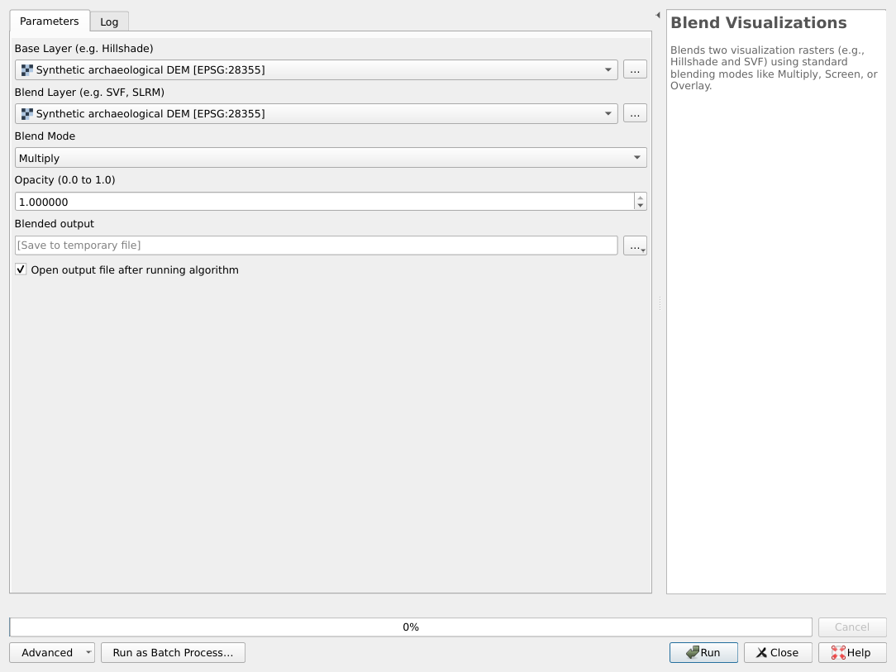

**How to use it**

1. Load two co-registered rasters with the same grid.
2. Choose them as the base and blend inputs.
3. Start with **Multiply** for shaded texture, **Screen** for a lighter result,
   or **Overlay** for stronger contrast.
4. Adjust opacity, run, and retain both sources so the composite remains
   explainable.

<!-- feature:lidar_relief:batch_relief -->
#### Batch Relief Visualisation

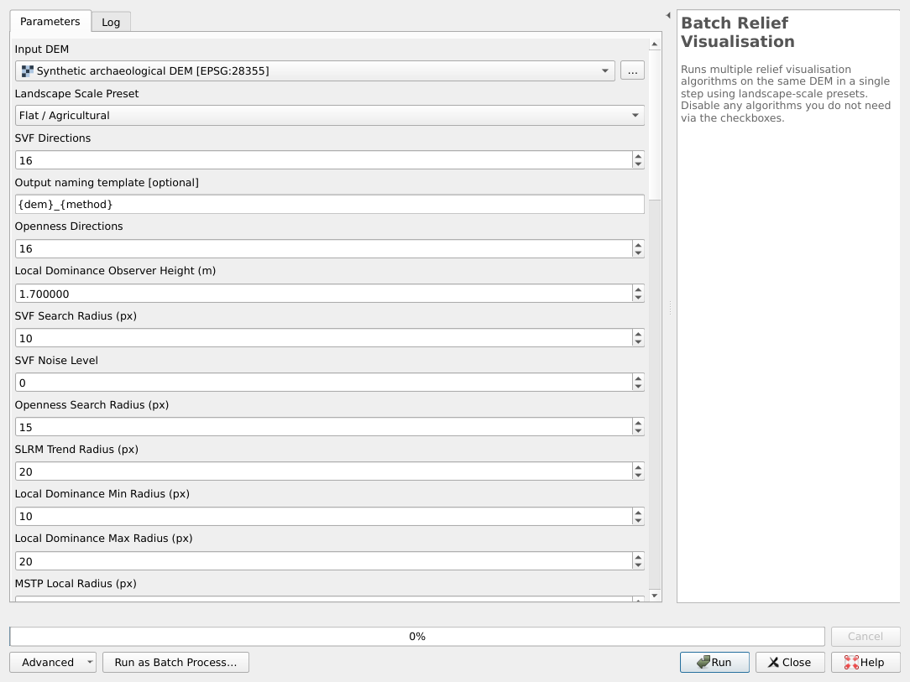

**How to use it**

1. Select the DEM and the closest landscape preset.
2. Untick products you do not need, then review radii and the optional naming
   template.
3. Choose an empty output folder and run; large DEMs can generate several
   substantial rasters.
4. Compare the outputs together and save the resolved recipe when you need a
   repeatable survey.

<!-- feature:lidar_relief:visualisation_contact_sheet -->
#### Visualisation Contact Sheet

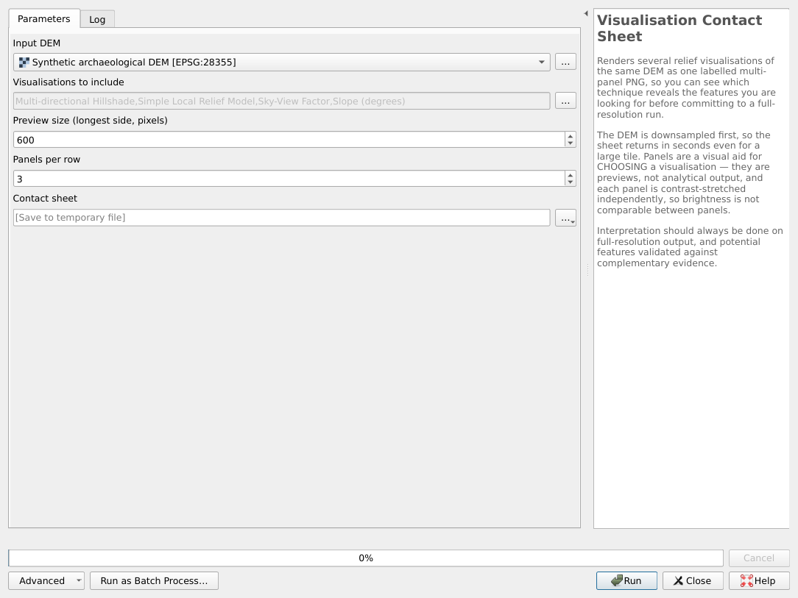

**How to use it**

1. Select the DEM and tick the techniques you want to preview.
2. Choose a preview size and panels per row.
3. Run to create a labelled PNG; independent panel stretches make shapes, not
   brightness, the valid comparison.
4. Select promising methods and rerun them at full DEM resolution.

<!-- feature:lidar_relief:ml_export -->
#### ML-Ready VRT Export

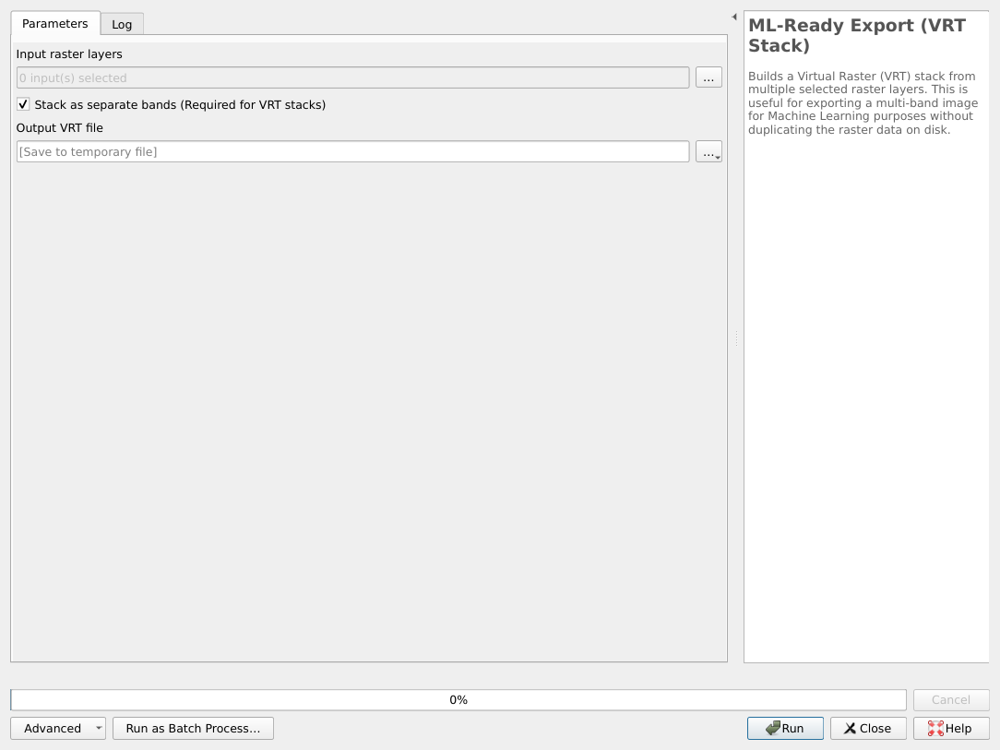

**How to use it**

1. Select co-registered visualization rasters in a consistent band order.
2. Choose the normalization strategy expected by the downstream model.
3. Set an output VRT and run.
4. Keep the band order, normalization, CRS, and pixel size with the training
   metadata; a VRT references its sources, so do not move them independently.

<!-- feature:lidar_relief:cog_export -->
#### Export to Cloud-Optimized GeoTIFF

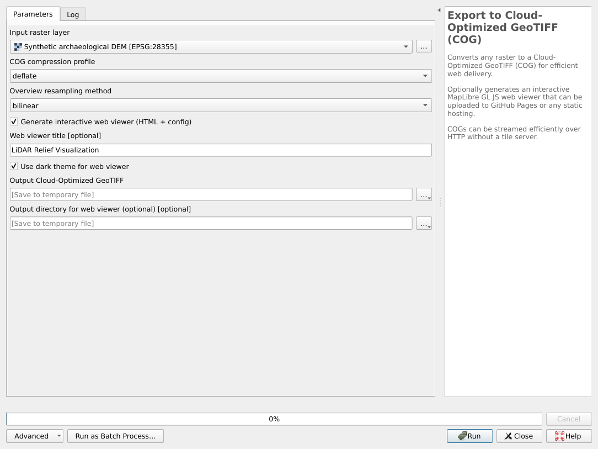

**How to use it**

1. Select a finished raster and an output `.tif`.
2. Choose DEFLATE for broad compatibility, or another supported compression
   profile.
3. Enable the web viewer only when you also want a publishable static viewer.
4. Run, then validate the output before uploading; the COG preserves data, not
   necessarily QGIS project styling.

<!-- feature:lidar_relief:webviewer -->
#### Generate Web Viewer

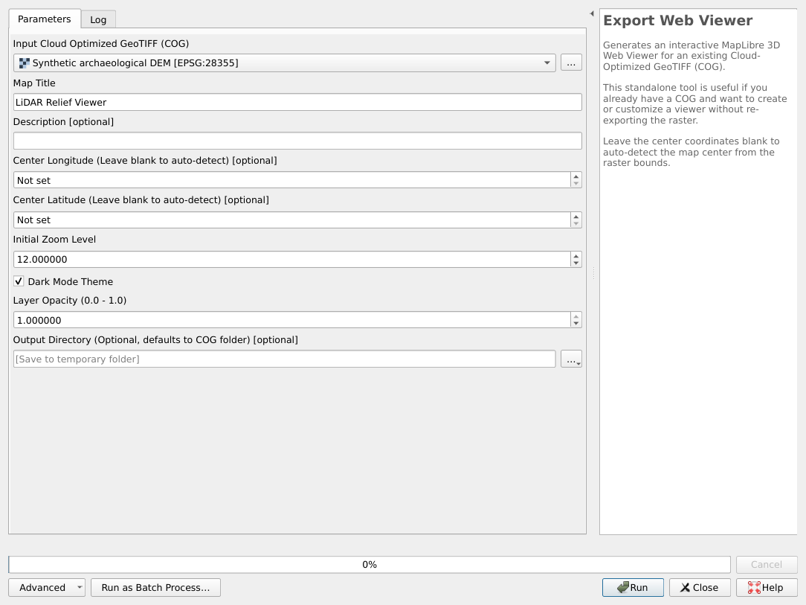

**How to use it**

1. Select a web-accessible COG or the COG produced by the export tool.
2. Enter the map title, attribution, initial view, and output folder.
3. Run to write the static MapLibre viewer files.
4. Test through a local web server, then deploy the whole folder; opening the
   HTML directly from disk may be blocked by browser security rules.

<!-- feature:lidar_relief:field_survey_export -->
#### Package for Field Survey

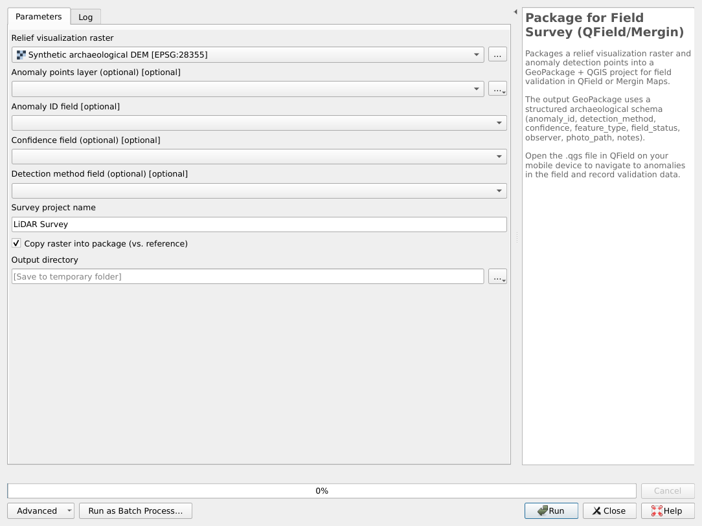

**How to use it**

1. Select the terrain rasters and any field vector layers to include.
2. Choose the project CRS, package name, and output folder.
3. Run to create the QField/Mergin-oriented survey package.
4. Open the packaged project on the target device before leaving the office
   and confirm layers, forms, symbology, and offline coverage.

<!-- feature:lidar_relief:pdf_report -->
#### Generate PDF Report

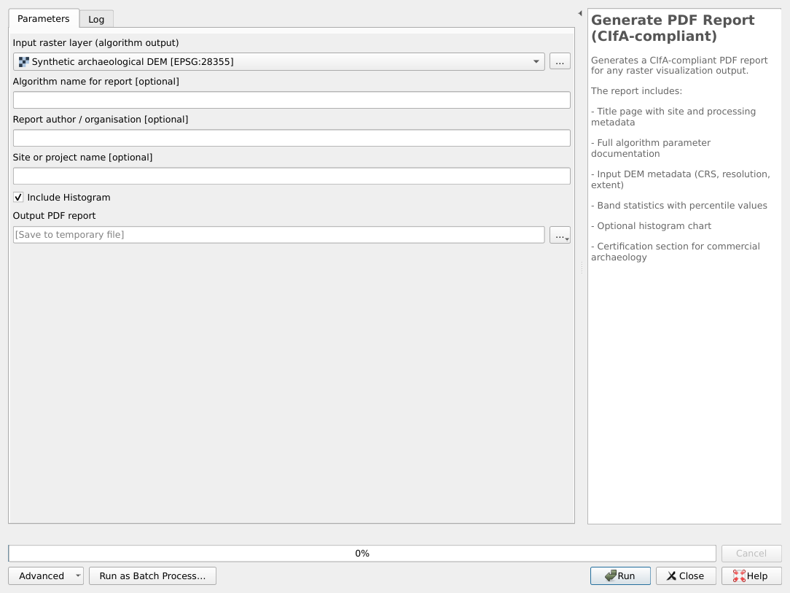

**How to use it**

1. Select the map layers/results and enter project/site metadata.
2. Add interpretation carefully and distinguish observations from conclusions.
3. Choose the PDF output and run.
4. Review scale, legends, citations, and provenance before circulation.

<!-- feature:lidar_relief:recipe_export -->
#### Export Visualization Recipe

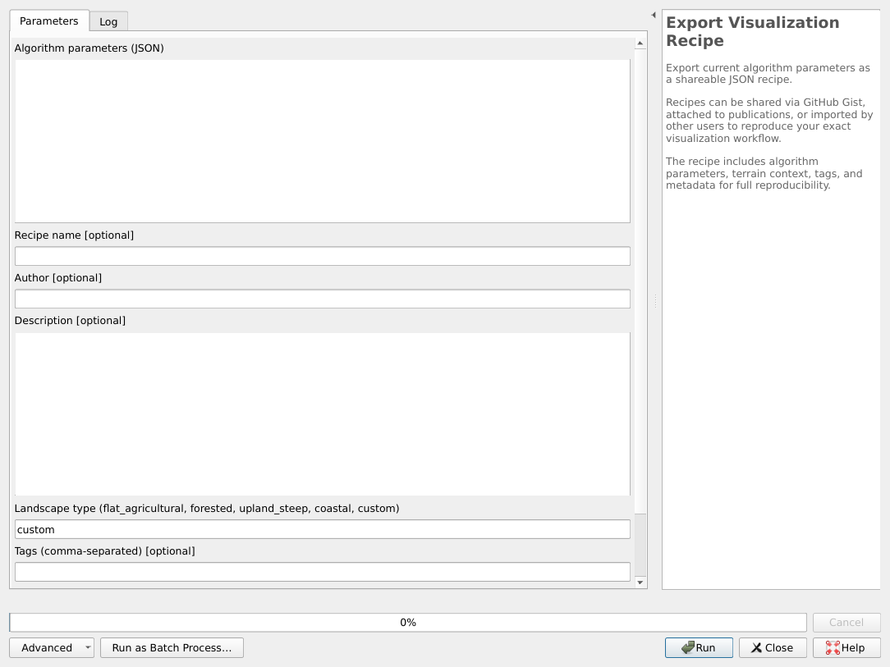

**How to use it**

1. Choose the visualization and enter the settings you want to preserve.
2. Add a clear name and optional notes about landscape and DEM resolution.
3. Export the JSON recipe.
4. Store it with the project and provenance sidecars; recipes describe a
   workflow, not its input data.

<!-- feature:lidar_relief:recipe_import -->
#### Import and Apply Visualization Recipe

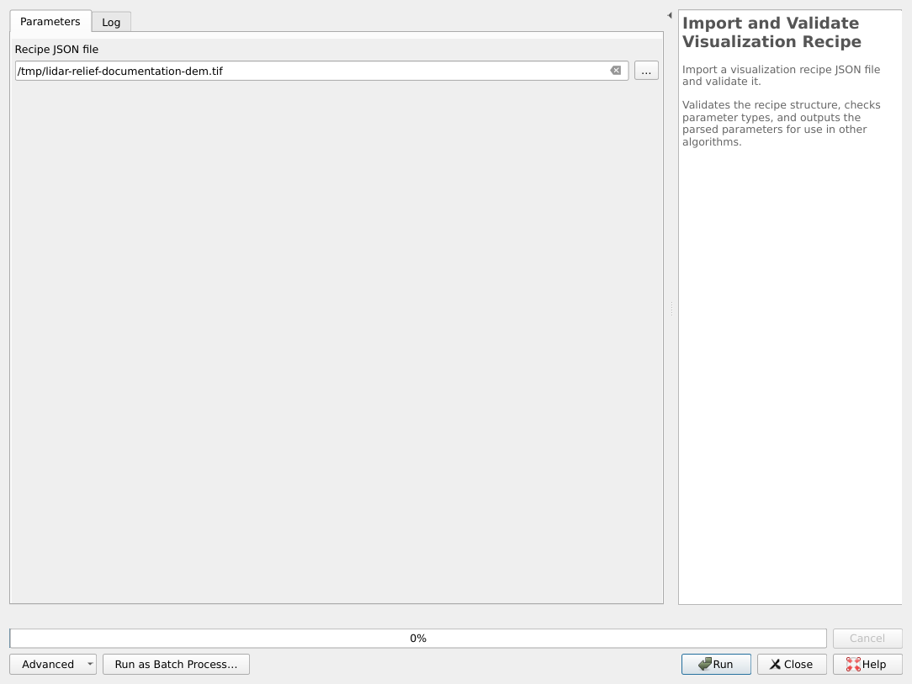

**How to use it**

1. Select a trusted recipe JSON and the target DEM.
2. Review the resolved algorithm and every parameter before running it.
3. Choose an output location and apply the recipe.
4. Check that its radii suit the new DEM resolution; identical numbers do not
   guarantee an equivalent real-world scale.

<!-- feature:lidar_relief:inspect_provenance -->
#### Inspect Provenance

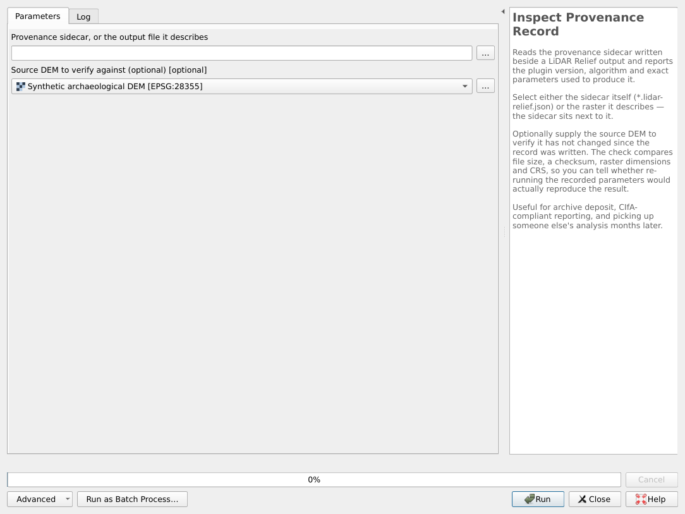

**How to use it**

1. Select a LiDAR Relief raster or its provenance sidecar.
2. Run to read the source, algorithm, parameters, versions, and integrity
   information.
3. Compare those details with the current project before reusing the result.
4. Missing provenance is not proof of invalid data, but it should trigger
   additional verification.

<!-- feature:lidar_relief:csf_ground_filter -->
#### CSF Ground Filter

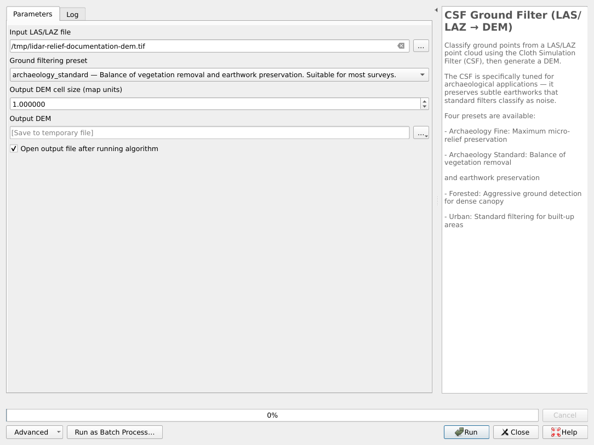

**How to use it**

1. Confirm the optional CSF dependency, then select a LAS/LAZ point cloud.
2. Choose cloth resolution near the point spacing and set terrain steepness
   appropriately.
3. Select ground-point and/or DEM outputs and run.
4. Inspect hilltops, walls, vegetation, and steep breaks for misclassification
   before using the DEM archaeologically.

<!-- feature:lidar_relief:pdal_classify -->
#### PDAL Ground Classification

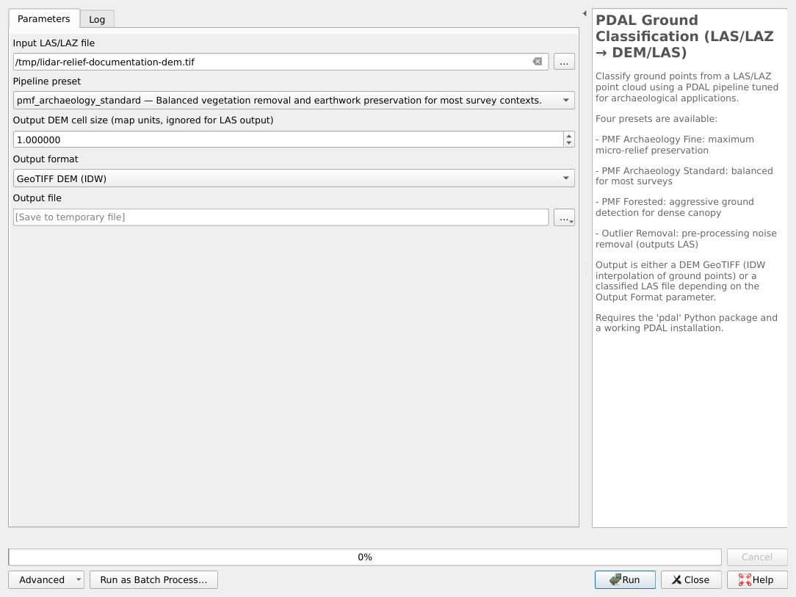

**How to use it**

1. Confirm PDAL is installed and select the point cloud.
2. Choose a ground-classification method and conservative starting parameters.
3. Set an output LAS/LAZ and run.
4. Colour the result by classification in QGIS and inspect representative
   terrain before rasterization.

<!-- feature:lidar_relief:temporal_difference -->
#### Multi-Temporal DEM Difference

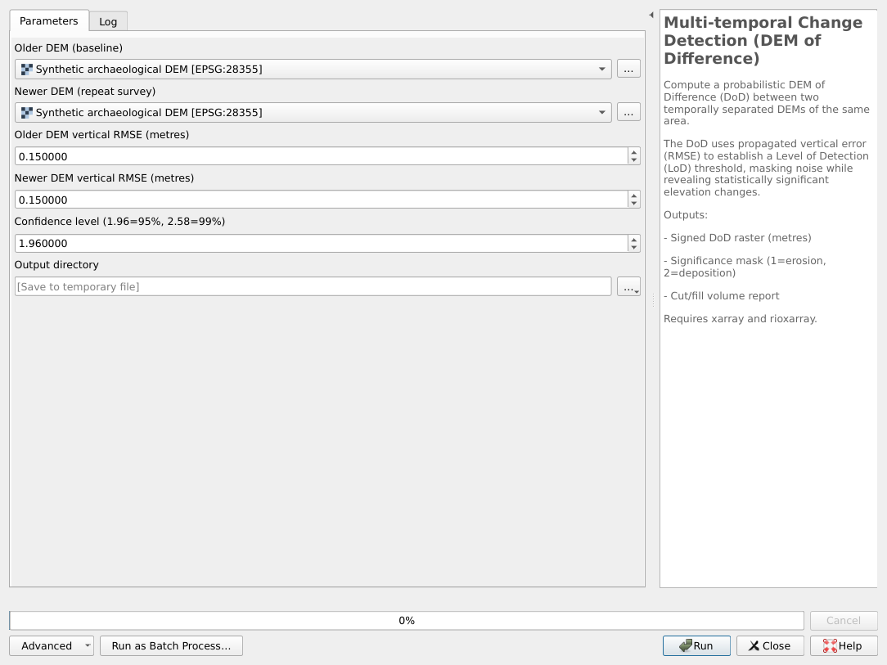

**How to use it**

1. Select earlier and later DEMs covering the same area.
2. Ensure their CRS, datum, resolution, and alignment are genuinely
   comparable.
3. Set the change threshold and output, then run.
4. Positive/negative values indicate elevation change; verify registration,
   acquisition, and vegetation differences before interpreting them as site
   change.

<!-- feature:lidar_relief:multi_sensor_fusion -->
#### Multi-Sensor Fusion

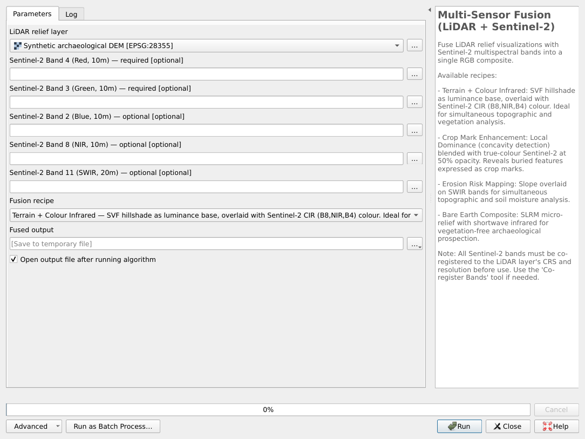

**How to use it**

1. Select the LiDAR-derived raster and a co-registered secondary sensor layer.
2. Choose bands and normalization appropriate to that sensor.
3. Set fusion weights, output, and run.
4. Inspect the source layers alongside the composite; colour correlations can
   be visually persuasive without sharing a physical cause.

<!-- feature:lidar_relief:ai_feature_detection -->
#### AI Feature Detection

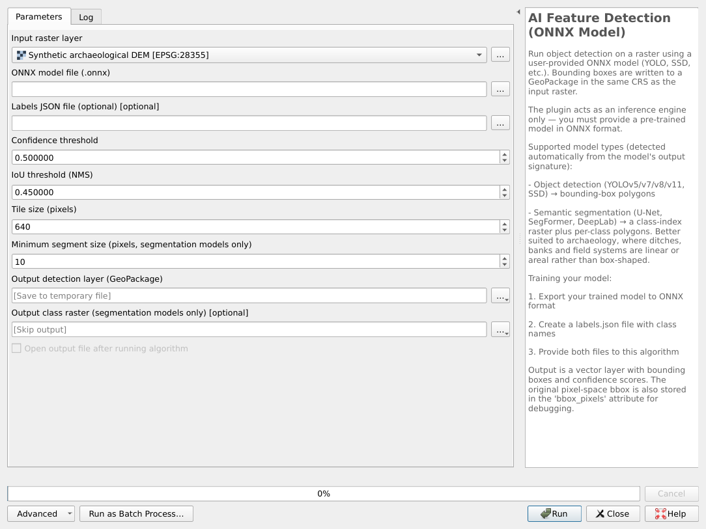

**How to use it**

1. Confirm ONNX Runtime, then select the raster stack expected by your model.
2. Select a trusted ONNX model and match its band order, normalization, tile
   size, and class configuration.
3. Choose probability/class raster and polygon outputs, then run.
4. Review detections against the source terrain and independently validate
   them; model output is a prioritisation aid, never archaeological proof.

### Terrain Visualization and Analysis

| Algorithm | Description | Best For |
|-----------|-------------|----------|
| **Multi-directional Hillshade** | Blends illumination from 4+ sun azimuths | General prospection, ridge-and-furrow |
| **Simple Local Relief Model (SLRM)** | Removes macro-topography using trend radius | Barrows, mounds, platforms |
| **Sky-View Factor (SVF)** | Diffuse illumination simulation | General prospection, ditches |
| **Anisotropic SVF (ASVF)** | Directionally weighted SVF | Linear features perpendicular to light |
| **Topographic Openness** | Positive = ridges, Negative = valleys | Stone walls (positive), ditches (negative) |
| **RVT Multi-directional Hillshade** | rvt-py reference implementation | Cross-validating against other RVT installs |
| **RVT Topographic Openness** | rvt-py reference implementation | Cross-validating against other RVT installs |
| **Local Dominance** | Mean depression angle, in degrees | Subtle barrows, hollow ways |
| **Multi-Scale TP (MSTP)** | DEV at Broad/Meso/Local → RGB | Complex multi-period landscapes |
| **Enhanced 4-MSTP (e4MSTP)** | 4-step composite (LD+Openness+Slope+SVF+MSTP) | Flat terrain, alluvial plains |
| **VAT Composite** | Hillshade + Slope + Openness blend | European heritage base maps |
| **Simple Red Relief** | Patent-free RRIM analogue | Tropical/Mesoamerican surveys |
| **PCA Composite** | PCA of 16+ directional hillshades | Ridge-and-furrow, Roman roads |
| **Slope** | Degrees and percent | Terrain analysis |
| **Terrain Ruggedness Index (TRI)** | Riley 3×3 local elevation contrast | Scarps, banks, stone spreads, quarrying, rough ground |
| **Blend Visualizations** | Multiply, Screen, Overlay modes | Custom composites |
| **Batch Relief Visualisation** | Multi-algorithm single-pass | Survey workflow efficiency |
| **Visualisation Contact Sheet** | Several techniques as one labelled image | Choosing a visualization before a full run |
| **ML-Ready VRT Export** | Normalized multi-band composites | CNN/LiDAR training datasets |

#### Choosing a search radius

Sky-View Factor, Topographic Openness, ASVF, SLRM and RVT Openness accept
their radius in either **pixels** or **metres**. Pixels remain the default so
existing Processing models keep working, but metres are usually what you
actually mean: archaeological features have a real-world size, whereas a
20-pixel radius is 20 m on a 1 m DEM and only 5 m on 0.25 m LiDAR.

Whichever you choose, the Processing log reports the radius both ways, for
example `SVF search radius: 80 px = 20.0 m (cell size 0.25 m)`. If that
real-world figure looks too small for the earthwork you are hunting, the
setting is wrong regardless of how reasonable the pixel count looked.

#### Visualisation Contact Sheet

Renders several visualizations of the same DEM as a single labelled
multi-panel PNG, so you can see which technique reveals your features before
committing to a full-resolution run.

The DEM is downsampled before anything is computed, so a sheet returns in
seconds even for a large tile. Choose the visualizations to include, the
preview size, and how many panels per row.

Two things to keep in mind:

- Panels are **previews for choosing a technique**, not analytical output.
  Interpret on full-resolution results.
- Each panel is contrast-stretched independently, so **brightness is not
  comparable between panels** — only structure is.

Panel captions require `Pillow`. Without it the sheet still renders, with
panels in the order listed in the algorithm dialog.

#### Terrain Ruggedness Index (TRI)

TRI measures how strongly each DEM cell differs from its eight immediate
neighbours. Values are expressed in the DEM's elevation units: zero indicates
locally flat terrain, while larger values indicate stronger local relief.

Use TRI to screen for abrupt microtopographic changes such as banks, scarps,
stone spreads, quarry edges, erosion, and disturbed ground. Compare results
only between DEMs with similar resolution and vertical units, because changing
the cell size changes the neighbourhood represented by the 3×3 window. TRI is
a prospection aid, not an archaeological classification; verify anomalies
against other visualizations and field evidence.

---

### Export and publishing

#### Export to Cloud-Optimized GeoTIFF (COG)

Converts any algorithm output to a cloud-optimized GeoTIFF with internal
tiling and overviews. Optionally generates an interactive MapLibre GL JS
web viewer that can be uploaded to GitHub Pages, Netlify, S3, or any static
host.

**Workflow:**
1. Run any relief algorithm (e.g., SVF)
2. Run **Export to Cloud-Optimized GeoTIFF (COG)** on the output
3. Select a compression profile (DEFLATE, LZW, ZSTD, or raw)
4. Check "Generate interactive web viewer"
5. Upload both the `.tif` and the viewer folder to a web host

**Requirements:** `rio-cogeo` Python package (`pip install rio-cogeo`)

#### Package for Field Survey (QField/Mergin)

Packages relief rasters and anomaly detection points into a GeoPackage with
structured archaeological schema, plus a QGIS project file that opens directly
in QField on mobile devices.

**GeoPackage schema fields:**
- `anomaly_id` — Unique identifier
- `detection_method` — How the anomaly was detected (svf, hillshade, manual, etc.)
- `confidence` — Detection confidence 0.0–1.0
- `feature_type` — Interpreted type (barrow, ditch, platform, etc.)
- `field_status` — Validation status (pending, confirmed, rejected, uncertain)
- `observer`, `photo_path`, `notes`, `timestamp`

**Workflow:**
1. Create anomaly points (either manually or from AI detection)
2. Run **Package for Field Survey (QField/Mergin)**
3. Copy the output directory to your mobile device
4. Open the `.qgs` file in QField
5. Navigate to each anomaly and update the field_status

#### Generate PDF Report

Creates a CIfA-compliant PDF report documenting:
- Title page with site/project metadata
- Full algorithm parameter documentation
- Input DEM metadata (CRS, resolution, extent)
- Band statistics with percentile values (P5, P25, P50, P75, P95)
- Histogram chart
- Certification section

**Requirements:** `reportlab` Python package (`pip install reportlab`)

#### Visualization Recipes

Export any set of algorithm parameters as a JSON recipe file that can be
shared via GitHub Gist, attached to publications, or imported by other
users. Recipes include versioned schema, type validation, and metadata
(name, author, description, tags, landscape type).

**Example use case:**
1. Optimize SVF parameters for barrow detection on chalk downland
2. Export as `barrow_chalk.json`
3. Share with colleagues or publish alongside your paper
4. Anyone can import your recipe and reproduce your exact visualization

#### Provenance sidecars

Every terrain output is written with a companion JSON file named after it —
`svf_output.tif.lidar-relief.json`. You do not need to enable anything.

Each record captures:
- Plugin version and algorithm
- The parameters **actually used**, including the resolved pixel radius as
  well as the metres you typed
- Source raster path, a checksum, CRS, grid size and cell size
- A UTC timestamp

Where a recipe describes *what you intended*, a sidecar records *what
happened* — to a specific file, on a specific day, from a specific input.

**Inspect Provenance Record** reads one back and prints it. Point it at either
the sidecar or the raster it describes. Optionally supply the source DEM and
it will verify the DEM has not changed since, comparing file size, checksum,
dimensions and CRS, and telling you plainly whether re-running the recorded
parameters would still reproduce the result.

Useful for archive deposit, CIfA-compliant reporting, and picking up your own
analysis — or a colleague's — months later.

Writing a sidecar can never fail the run that produced the raster; if the
location is unwritable, you get a log note and your output.

---

### GPU acceleration

Sky-View Factor and Topographic Openness have a **Use GPU acceleration**
checkbox. With CuPy installed against a working CUDA driver, the horizon scan
runs on the GPU; GPU and CPU walk the same horizon rays, so results agree to
floating-point precision rather than merely being similar.

Ticking the box can never fail a run. Without CuPy, with a broken driver, or
with SVF noise removal enabled (that filter is CPU-only), the algorithm falls
back to NumPy and logs the reason.

**Requirements:** `cupy-cuda12x` matching your CUDA version
(`pip install cupy-cuda12x`)

---

### Point-cloud processing

#### CSF Ground Filter (LAS/LAZ → DEM)

Generate a DEM directly from raw LiDAR point clouds using the Cloth
Simulation Filter (CSF), with presets specifically tuned for archaeology.

**Presets:**

| Preset | Description | Use Case |
|--------|-------------|----------|
| Archaeology Fine | Maximum micro-relief preservation | Subtle earthworks on flat terrain |
| Archaeology Standard | Balanced vegetation removal | Most surveys |
| Forested | Aggressive ground detection | Dense canopy |
| Urban | Standard filtering | Built-up areas |

**Requirements:** `cloth-simulation-filter` Python package
(`pip install cloth-simulation-filter`) + `laspy` for LAS/LAZ reading
(`pip install laspy`)

---

### Multi-temporal change detection

Compute a probabilistic DEM of Difference (DoD) between two temporally
separated DEMs to detect landscape change.

**How it works:**
1. Load two DEMs: older (baseline) and newer (repeat survey)
2. Co-register to identical grid (reproject if needed)
3. Compute: `DoD = DEM_new - DEM_old`
4. Propagate vertical error: `σ = sqrt(RMSE_old² + RMSE_new²)`
5. Apply Level of Detection: changes below `1.96 × σ` are masked as noise

**Outputs:**
- Signed DoD raster (metres) — positive = deposition/fill,
  negative = erosion/cut
- Significance mask (0=no change, 1=erosion, 2=deposition)
- Volume report with cut/fill totals

**Requirements:** `xarray` and `rioxarray`
(`pip install xarray rioxarray`)

---

### Multi-sensor fusion

Co-register Sentinel-2 multispectral bands with LiDAR relief and apply
blend recipes.

**Recipes:**

| Recipe | LiDAR Layer | Satellite Bands | Effect |
|--------|-------------|-----------------|--------|
| Terrain + CIR | SVF (luminance) | B8, B4, B3 (CIR) | Topography + vegetation |
| Crop Mark Enhancement | Local Dominance | B4, B3, B2 (true colour) | Buried features |
| Erosion Risk | Slope | B11, B8, B4 (SWIR+NIR) | Soil moisture + slope |
| Bare Earth Composite | SLRM | B11, B12, B4 | Vegetation-free prospection |

**Requirements:** `rasterio` and `rioxarray`
(`pip install rasterio rioxarray`)

---

### AI feature detection

Run object detection or semantic segmentation on plugin visualizations
using your own pre-trained ONNX model. The plugin is an inference engine
only — you supply the trained model.

**Supported model types.** The type is detected automatically from the
model's output signature; you do not select it.

| Type | Recognised by | Output |
|------|---------------|--------|
| **Object detection** (YOLOv5/v7/v8/v11, SSD) | A 3-D `(N, boxes, attrs)` output, or several output tensors | Bounding-box polygons with class and confidence |
| **Semantic segmentation** (U-Net, SegFormer, DeepLab) | A single 4-D `(N, C, H, W)` output | A class-index raster **and** per-class polygons carrying area, pixel count and mean confidence |

Instance segmentation (Mask R-CNN and similar) is **not** supported. Earlier
versions of this guide listed it; that was never implemented.

**Which should you use?** For archaeology, segmentation is usually the better
fit. Ditches, banks, field systems and hollow ways are linear or areal, and a
bounding box around a 400 m field boundary conveys very little. Detection
suits compact, countable features such as barrows or shell mounds.

**Workflow:**
1. Train a model externally (PyTorch, Ultralytics, etc.)
2. Export to ONNX format
3. Create a `labels.json` file with class names. Either a list, or an
   object keyed by class index — for segmentation, index 0 is treated as
   background and is excluded from the polygon output.
4. In QGIS, run **AI Feature Detection (ONNX Model)**
5. Results are written as a GeoPackage vector layer. Segmentation models can
   additionally write the class-index raster, which is the primary evidence —
   the polygons are derived from it and are lossy at feature boundaries.

**Segmentation settings worth knowing:**
- *Confidence threshold* — pixels whose winning class scores below this become
  background, rather than asserting a class the model was unsure about.
- *Minimum segment size* — drops polygons below this pixel count. Single-pixel
  speckle is model noise, not archaeology. If you get a populated class raster
  but no polygons, this is set too high.

The raster is normalised against whole-raster percentiles before inference, so
tiles are consistent with one another and the resulting map has no seams from
tiles being scaled in isolation.

**Requirements:** `onnxruntime` (`pip install onnxruntime`)

---

## Batch Processing

The **Batch Relief Visualisation** tool runs multiple algorithms in a single
pass. Choose from 4 research-validated terrain presets or use manual settings:

- **Flat / Agricultural**: Optimized for ploughed-out features in low-relief
  terrain. SVF radius 20 m, openness 15 m, SLRM radius 20 m,
  LD observer height 1.7 m.
- **Forested**: Dense canopy where ground points are sparse. SVF radius 10 m,
  openness 5 m, SLRM radius 12 m, LD observer height 1.5 m.
- **Upland / Steep**: Prevents steep slopes from overpowering micro-relief.
  SVF radius 5 m, openness 5 m, SLRM radius 8 m.
- **Coastal**: Broad search radii for dune/estuarine modifications.
  SVF radius 15 m, openness 10 m, SLRM radius 25 m,
  LD observer height 2.0 m.

Preset distances are defined in **metres** and converted using your DEM's cell
size, so a preset means the same real-world thing at any resolution. The log
reports the converted pixel values at the start of each run.

Set **Optional named-output folder** to create a complete, consistently named
result set. The template accepts `{dem}`, `{method}`, `{preset}`, and `{date}`;
for example, `{dem}_{method}_{date}`. Folder separators and unknown fields are
rejected. Set **Optional saved recipe for this run** to preserve the resolved
settings after a successful run, including pixel values calculated from a
metre-based preset.

The e4MSTP dialog also exposes its component scales under QGIS's advanced
parameters. Leaving them unchanged reproduces the canonical implementation:
openness radius 10, Local Dominance radii 10–20, MSTP radii 3–20–100, and tile
size 1024 pixels.

> Before v2.1 these distances were stored as pixel counts, which made the
> presets correct only on a 1 m DEM — on 0.25 m LiDAR every preset radius was
> silently a quarter of its intended size. If you have batch output from an
> earlier version on a non-1 m DEM, it was computed at a different scale than
> the figures above imply.

---

## Best Practices

1. **CRS**: Ensure your DEM is projected in a metric CRS (UTM or local grid),
   not geographic (degrees in latitude/longitude). The plugin warns you in the
   Processing log if it is not, and also if your pixels are not square — but
   the warning is advisory, so read the log rather than assuming silence.
2. **Pick a technique first**: Run the Contact Sheet before a full-resolution
   run. It costs seconds and often saves a wasted half-hour.
3. **Start with Batch**: Use the Batch tool with a matching terrain preset.
4. **Think in metres**: Set search radii in metres and sanity-check the
   real-world figure the log reports against the size of the feature you are
   looking for.
5. **Iterate**: If features are too faint, increase search radii. If too noisy,
   decrease them.
6. **SVF Noise**: Enable noise reduction for DEMs with point-cloud noise
   or complex topography. Note this filter is CPU-only, so it overrides the
   GPU checkbox.
7. **e4MSTP**: Prepare for longer processing — it computes 7 underlying
   algorithms.
8. **Export**: Use COG export for sharing with non-GIS stakeholders.
9. **Field validation**: Use the Field Survey Export for ground-truthing.
10. **Reproducibility**: Keep the provenance sidecar with any output you
    publish or deposit, and export a Visualization Recipe alongside it.
11. **AI models**: The plugin is an inference engine only — train models
    externally in PyTorch/Ultralytics and export to ONNX. Prefer segmentation
    over detection for linear and areal features.

---

## Optional Dependencies

| Feature | Package | Install command |
|---------|---------|----------------|
| COG Export | `rio-cogeo` | `pip install rio-cogeo` |
| PDF Reports | `reportlab` | `pip install reportlab` |
| CSF Ground Filter | `cloth-simulation-filter` | `pip install cloth-simulation-filter` |
| Temporal Analysis | `xarray`, `rioxarray` | `pip install xarray rioxarray` |
| Multi-Sensor Fusion | `rasterio`, `rioxarray` | `pip install rasterio rioxarray` |
| AI Detection | `onnxruntime` | `pip install onnxruntime` |
| GPU Acceleration | `cupy-cuda12x` | `pip install cupy-cuda12x` |
| LAS/LAZ input | `laspy` or `pdal` | `pip install laspy` |
| RVT Relief Toolbox | `rvt-py` | `pip install rvt-py` |
| Contact sheet panel captions | `Pillow` | `pip install Pillow` |

## Getting help and reporting problems

Use **Plugins → LiDAR Relief → Create Support Bundle…** to create a redacted ZIP
containing plugin/QGIS diagnostics and, when a DEM is active, its preflight
report. Review the ZIP before attaching it to an issue; common secret
assignments and the current home-directory prefix are masked automatically.

Documentation images follow a strict provenance rule: mockups and AI-generated
imagery are not presented as plugin output. The guide's TRI figure is generated
directly from the tested core algorithm, carries generator metadata, and is
checked by the automated test suite.

When reporting an issue, include your operating system, QGIS version, plugin
version, the full Processing log, input CRS and raster resolution, and the
smallest dataset or steps that reproduce the problem. Do not attach sensitive
site coordinates or restricted heritage data to a public issue.

- [Issue tracker](https://github.com/dig-tools/lidar-relief-qgis-plugin/issues)
- [Source and releases](https://github.com/dig-tools/lidar-relief-qgis-plugin)
- [Official QGIS listing](https://plugins.qgis.org/plugins/lidar_relief/)

All features degrade gracefully with clear error messages if a dependency
is missing.
